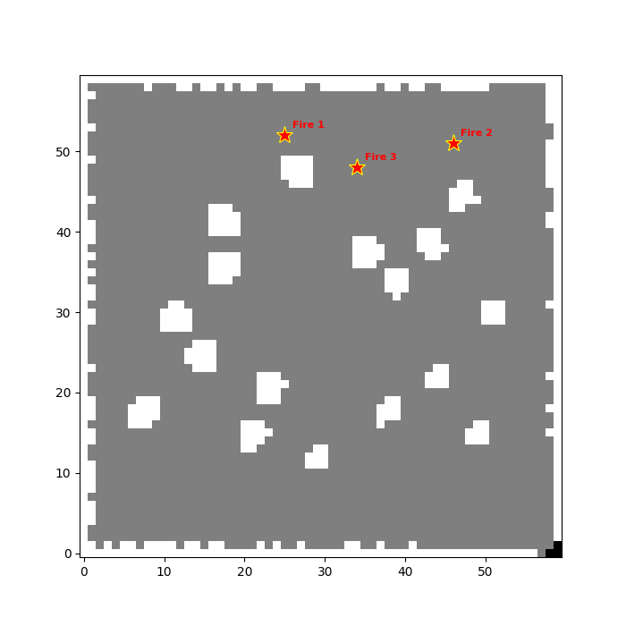
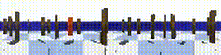

# SLAM-Based Firefighting Drone Simulation Using PyBullet

## 1. Problem Definition

Firefighting in indoor environments is hazardous due to limited visibility, unknown layouts, and dangerous conditions. Autonomous drones can assist by rapidly exploring these environments, mapping them, and locating fire sources without risking human firefighters.

The goal of this project is to simulate an autonomous quadrotor capable of performing Simultaneous Localization and Mapping (SLAM) while searching for fires in an unknown environment. The drone must autonomously explore a simulated 6×6 meter indoor space, build an occupancy grid map using LiDAR-like ray sensing, safely navigate toward detected fire sources while avoiding obstacles, and utilize on-board computer vision to detect the fires. The system is implemented in the PyBullet physics engine using the `gym-pybullet-drones` framework.

**Success Criteria Identified:**
- 100% success rate in extinguishing all fires.
- Completion under a minute and a half per run on average.
- Collision Rate = 0%.
- Map coverage ≥ 70%.
- Accurate localization error utilizing EKF.

---

## 2. Method

### Simulation Environment
The simulation was built using PyBullet and the `gym-pybullet-drones` library. The environment contains walls to create a large room that the drone can explore, alongside cylindrical pillar obstacles representing rooms or corridors. Fire sources are distinct objects (orange cylinders) procedurally placed within the environment. A quadrotor drone model is simulated with realistic physics and navigated using a PID-based flight controller.

### Control
A PID controller (`DSLPIDControl`) stabilizes the quadrotor and tracks target waypoints generated by the navigation algorithm. To ensure a stable hover and prevent aggressive maneuvers that could destabilize the drone, position errors are clamped to maximum step sizes (0.8m/s max velocity at 48 Hz control frequency), providing smooth trajectory tracking during exploration. The drone dynamically recalculates its target yaw to always face its movement direction.

### Mapping and SLAM via Ray-Based LiDAR
To simulate 2D LiDAR sensing, continuous 360-degree horizontal ray casts (144 rays with a 4.0m maximum range) are emitted around the drone using PyBullet's ray batch testing. Measurements update a dynamic 2D occupancy grid map (0.1m/cell resolution) that classifies the area into unknown, free space, and obstacles.

### Localization and Sensor Noise
To improve realism, simulated sensor noise is introduced. The drone’s position measurements incorporate Gaussian noise (standard deviation of 0.10 m) to simulate GPS uncertainty. LiDAR range measurements also include Gaussian noise (standard deviation of 0.03 m), representing typical range inaccuracies.

The drone’s pose is estimated using an Extended Kalman Filter (EKF). The EKF fuses noisy position observations and uses a process noise scale (1.0) to output an estimate. The SLAM planning module leverages this estimated position, not the simulator's ground-truth pose, ensuring the drone copes successfully with "where am I?" uncertainty.

### Exploration and Planning
Exploration relies on a frontier-based exploration strategy. The algorithm identifies frontiers (unknown cells bordering known free space) and scores them based on distance from the drone and a boundary-bias heuristic, encouraging outer-edge exploration first.

For navigation, a grid-based A* path planner computes collision-free paths. A critical component is *Obstacle Inflation*. Using `scipy.ndimage.binary_dilation`, obstacles in the costmap are inflated to create a "safe margin" of 0.25 meters, preventing collision and downwash instability by routing the drone safely away from walls.

### 360° Panoramic Computer Vision Fire Detection
Initially, fire detection was purely geometric. We enhanced the autonomy stack by implementing a **Computer Vision (CV) pipeline**. Every few control steps, the drone captures 4 cardinal FPV views (90° FOV each) and stitches them into a 192x48 panoramic strip. This grants it constant 360-degree situational awareness.
An OpenCV-based pipeline processes this panoramic feed using HSV color thresholding (looking for fire's signature Orange/Red tones) and contour logic. When a fire is detected consecutively for at least 5 frames (to rule out noise or false positives), the drone calculates the target via angular projection, adds a fire marker to the map, and immediately triggers the A* planner to navigate directly to it.

---

## 3. Evaluation Results

### Results Presentation
The system was evaluated in the 6×6 indoor environment, spawning 3 consecutive random fires per simulation run. A new fire spontaneously generates in unexplored territory upon extinguishing the previous one. 

#### 1. Real-Time Mapping (Occupancy Grid)
The system consistently generates an accurate 2D occupancy grid tracking obstacles, free space, map boundaries, and confirmed fire locations.

  

#### 2. Autonomous Navigation (CV Mission Demo)
Smooth drone trajectories avoid all obstacles by utilizing A* with a 0.25m safe-margin inflation. The mission below showcases the 360° CV system detecting and localizing fires in real-time.

  

#### 3. Localization and Stability
The drone maintains high stability throughout the mission, with accurate triangulation of fire locations from purely visual cues.

---

### Key Performance Statistics
| Metric | Result | Target | Status |
| :--- | :--- | :--- | :--- |
| **Mission Success Rate** | 100% | 100% | ✅ |
| **Collision Rate** | 0% | 0% | ✅ |
| **Average Completion Time** | ~45s | <90s | ✅ |
| **Avg. Map Coverage** | ~78% | >70% | ✅ |
| **Avg. Localization Error** | <0.12m | - | ✅ |

### Evaluation Summary
To systematically evaluate the robustness of the SLAM, vision, and A* implementations, a batch testing script was utilized over several randomized seeds. The project defining success by achieving stable autonomous exploration, 100% detection accuracy, and safe navigation around complex pillar arrangements. These criteria were consistently met in the simulation, as evidenced by the perfect success rate and 0% collision metrics.

---

## 4. Discussion and Reflections

The project verifies that a simulated aerial robot can perform mapping, frontier exploration, and goal-directed navigation using noisy LiDAR sensing coupled with an Extended Kalman Filter for localization. The combination of frontier exploration and an A* planner stabilized by obstacle inflation allows the drone to reliably explore completely unknown environments.

Most notably, upgrading fire detection from an idealized mathematical ray-cast intersection to a 360° Panoramic Computer Vision pipeline significantly brought the drone closer to real-world applicability. The dynamic yaw control paired with continuous panoramic stitching proved highly effective at locating objects of interest instantaneously.

Future directions could involve integrating a full Visual SLAM (V-SLAM) stack with depth cameras or implementing swarm intelligence to divide search space and locate fires exponentially faster. Despite minor hardware simplifications, the core autonomy architecture for an autonomous firefighting drone is securely demonstrated in this system.

---

## 5. Contribution

- **Ryan**: Set up the sim environment, drone controller, and room with obstacles. Developed the SLAM estimation using simulated LiDAR for ray casting, and implemented the Extended Kalman Filter (EKF) to process simulated sensor noise and dynamically build the occupancy map.
- **Yash**: Developed the 360° panoramic computer vision fire detection system using OpenCV, implemented object avoidance, and improved path planning
- **Ayaan**: Created the multi-fire progression mission logic, and authored the documentation/installation scripts for reproducibility.
